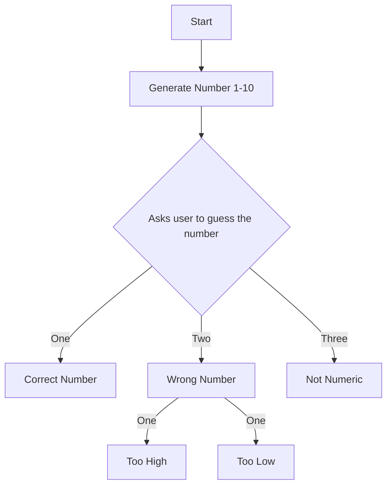

# Number Guessing
## Flowchart

## Documentation 
###### The Program is started and a number is generated. The user is asked to guess a number. Show the user if the input is correct, incorect, or invalid. If incorrect it shows if its too high or too low. 
